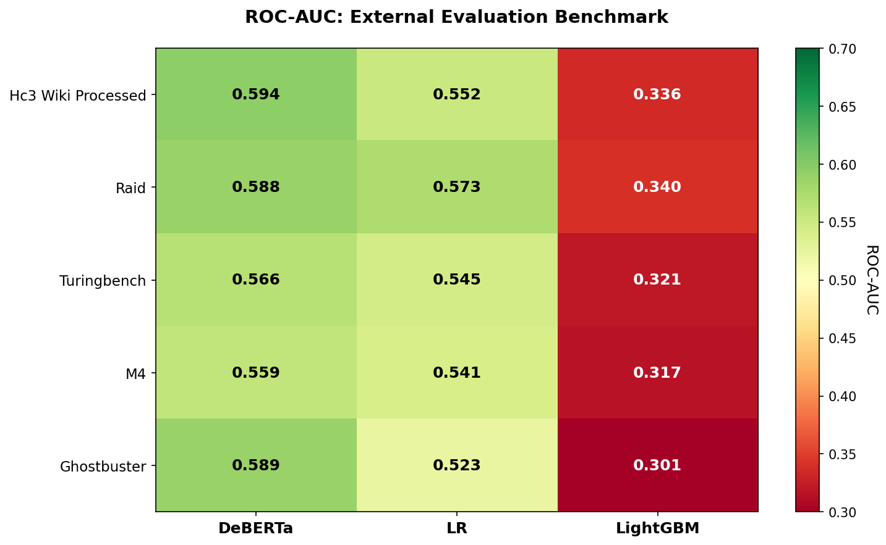
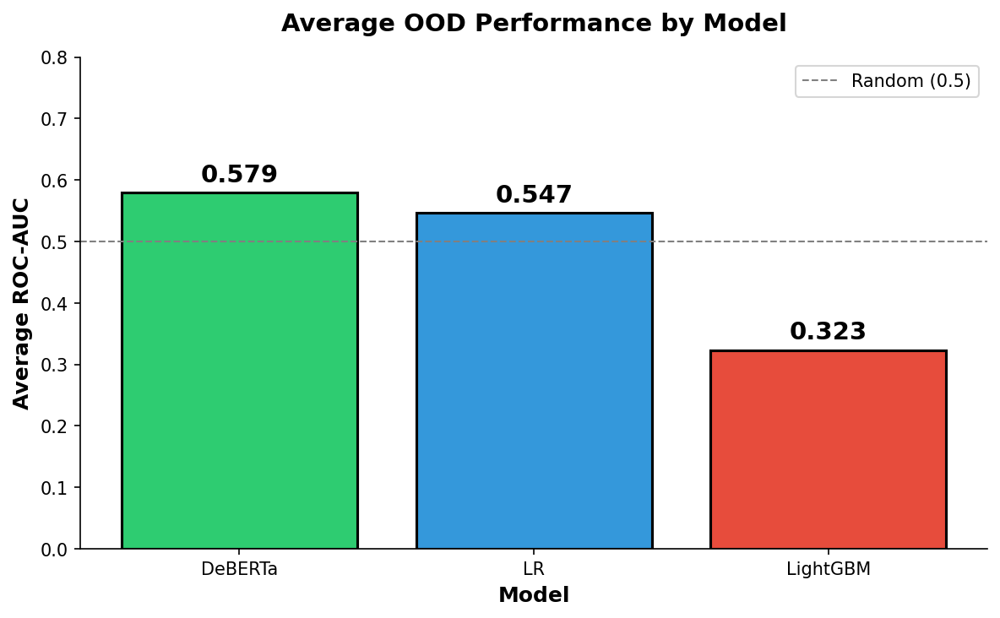

# Results: External Evaluation Benchmark

## Overview

Evaluated **3 models** (DeBERTa, LR, LightGBM) on **5 external datasets** using **5 metrics** each.

**Total evaluations**: 75 (3 × 5 × 5)

---

## ROC-AUC Summary

| Dataset | DeBERTa | LR | LightGBM |
|---------|---------|-----|----------|
| HC3-Wiki | **0.5939** | 0.5517 | 0.3356 |
| RAID | **0.5879** | 0.5727 | 0.3398 |
| TuringBench | **0.5660** | 0.5449 | 0.3209 |
| M4 | **0.5591** | 0.5409 | 0.3170 |
| GhostBuster | **0.5889** | 0.5227 | 0.3012 |
| **Average** | **0.5792** | 0.5466 | 0.3229 |

---

## Average OOD Performance

| Model | Avg ROC-AUC | Rank |
|-------|-------------|------|
| DeBERTa | 0.579 | 🥇 |
| LR | 0.547 | 🥈 |
| LightGBM | 0.323 | 🥉 |

---

## Key Findings

### 1. DeBERTa Leads on ROC-AUC
- Consistently achieves highest ROC-AUC across all datasets (0.56-0.59)
- Demonstrates better generalization to out-of-distribution data

### 2. Logistic Regression is Competitive  
- Close second place with ROC-AUC 0.52-0.57
- Simple TF-IDF features remain effective

### 3. LightGBM Underperforms
- ROC-AUC below random (0.30-0.34)
- Likely due to stylometric feature mismatch or overfitting to training distribution

### 4. Calibration Issues
- **DeBERTa F1 = 0**: Model predicts very low probabilities (<0.5 for all samples)
- Threshold tuning needed for deployment
- LR and LightGBM have better calibrated outputs

---

## Recommendations

1. **Threshold Tuning**: Find optimal decision threshold for DeBERTa (likely ~0.01-0.05)
2. **LightGBM Investigation**: Review feature engineering pipeline for train/test consistency
3. **Ensemble Approach**: Combine DeBERTa's ranking ability with LR's calibration

---

## Artifacts

| File | Description |
|------|-------------|
| `all_metrics.json` | Full JSON results |
| `comparison_table.md` | Formatted tables |
| `roc_heatmap.png` | Model × Dataset heatmap |
| `avg_performance_bar.png` | Average performance by model |