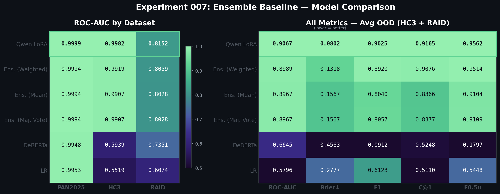

# Results: Ensemble Baseline

**Date Completed**: 2026-02-16
**Author**: harshul

## Summary

Ensembling LR, DeBERTa, and Qwen LoRA does **not** improve over Qwen LoRA alone on out-of-distribution benchmarks. The best ensemble strategy (Weighted) achieves avg OOD ROC-AUC of 0.8989 vs Qwen LoRA's 0.9067 — a drop of 0.78pp. The weaker models (LR at 0.58, DeBERTa at 0.66 avg OOD) dilute Qwen's predictions rather than complementing them. On in-distribution data (PAN2025), all strategies perform comparably.

**Verdict**: Rejected. No ensemble strategy beats Qwen LoRA solo. The performance gap between Qwen and the other models is too large for naive ensembling to help.

## Heatmap

## ROC-AUC Comparison

| Model | PAN2025 | HC3 | RAID | Avg OOD |
|-------|--------:|----:|-----:|--------:|
| Qwen LoRA (006) | **0.9999** | **0.9982** | **0.8152** | **0.9067** |
| Ensemble (Weighted) | 0.9994 | 0.9919 | 0.8059 | 0.8989 |
| Ensemble (Mean) | 0.9994 | 0.9907 | 0.8028 | 0.8967 |
| Ensemble (Majority Vote) | 0.9994 | 0.9907 | 0.8028 | 0.8967 |
| DeBERTa (003) | 0.9948 | 0.5939 | 0.7351 | 0.6645 |
| LR (001) | 0.9953 | 0.5519 | 0.6074 | 0.5796 |

## Full Metrics: All Models × All Datasets

|         |          | PAN2025 |    HC3 |   RAID | Avg OOD |
|---------|----------|--------:|-------:|-------:|--------:|
| **LR (001)** | ROC-AUC | 0.9953 | 0.5519 | 0.6074 | 0.5796 |
|         | Brier    | 0.0281 | 0.2705 | 0.2849 | 0.2777 |
|         | F1       | 0.9774 | 0.6068 | 0.6177 | 0.6123 |
|         | C@1      | 0.9707 | 0.5214 | 0.5005 | 0.5110 |
|         | F0.5u    | 0.9736 | 0.5481 | 0.5415 | 0.5448 |
| **DeBERTa (003)** | ROC-AUC | 0.9948 | 0.5939 | 0.7351 | 0.6645 |
|         | Brier    | 0.1106 | 0.4939 | 0.4187 | 0.4563 |
|         | F1       | 0.8834 | 0.0024 | 0.1800 | 0.0912 |
|         | C@1      | 0.8654 | 0.5006 | 0.5490 | 0.5248 |
|         | F0.5u    | 0.9498 | 0.0059 | 0.3536 | 0.1797 |
| **Qwen LoRA (006)** | ROC-AUC | **0.9999** | **0.9982** | **0.8152** | **0.9067** |
|         | Brier    | **0.0019** | **0.0112** | **0.1491** | **0.0802** |
|         | F1       | **0.9981** | **0.9868** | **0.8182** | **0.9025** |
|         | C@1      | **0.9975** | **0.9869** | **0.8460** | **0.9165** |
|         | F0.5u    | **0.9984** | **0.9947** | **0.9176** | **0.9562** |
| **Ensemble (Mean)** | ROC-AUC | 0.9994 | 0.9907 | 0.8028 | 0.8967 |
|         | Brier    | 0.0211 | 0.1346 | 0.1789 | 0.1567 |
|         | F1       | 0.9959 | 0.8354 | 0.7725 | 0.8040 |
|         | C@1      | 0.9947 | 0.8587 | 0.8145 | 0.8366 |
|         | F0.5u    | 0.9981 | 0.9269 | 0.8939 | 0.9104 |
| **Ensemble (Weighted)** | ROC-AUC | 0.9994 | 0.9919 | 0.8059 | 0.8989 |
|         | Brier    | 0.0157 | 0.0989 | 0.1647 | 0.1318 |
|         | F1       | 0.9972 | 0.9757 | 0.8083 | 0.8920 |
|         | C@1      | 0.9964 | 0.9762 | 0.8390 | 0.9076 |
|         | F0.5u    | 0.9986 | 0.9901 | 0.9126 | 0.9514 |
| **Ensemble (Majority Vote)** | ROC-AUC | 0.9994 | 0.9907 | 0.8028 | 0.8967 |
|         | Brier    | 0.0211 | 0.1346 | 0.1789 | 0.1567 |
|         | F1       | 0.9948 | 0.8378 | 0.7736 | 0.8057 |
|         | C@1      | 0.9933 | 0.8605 | 0.8150 | 0.8377 |
|         | F0.5u    | 0.9974 | 0.9281 | 0.8937 | 0.9109 |

## Observations

### Ensemble strategies are dragged down by weak models

The core issue is the extreme performance gap between Qwen LoRA and the other two models on OOD data. LR and DeBERTa score near random on HC3 (0.55, 0.59 ROC-AUC) while Qwen scores 0.998. Averaging these predictions dilutes Qwen's strong signal.

The **weighted ensemble** partially mitigates this (Qwen gets ~44% of the weight), but the correction is insufficient. It still underperforms Qwen solo by 0.63pp on HC3 and 0.93pp on RAID.

### DeBERTa's calibration hurts ensembles

DeBERTa's probabilities are poorly calibrated on OOD data — it gets 0.49 Brier on HC3 (worse than random at 0.25). When its near-0.5 predictions are averaged in, they pull the ensemble toward uncertainty on samples Qwen would confidently classify.

### Weighted ensemble is the best strategy

Among the three strategies, weighted performs best (avg OOD 0.8989) because it gives Qwen the largest share. Mean and majority vote are identical in ROC-AUC because majority vote uses the mean probability as its score.

### In-distribution performance is unaffected

All strategies maintain >0.999 ROC-AUC on PAN2025, confirming that ensembling doesn't hurt in-distribution. The weighted ensemble even matches Qwen on F1 (0.9972 vs 0.9981).

## Delta: Ensemble vs Qwen LoRA Solo

| Dataset | Qwen LoRA | Best Ensemble | Δ ROC-AUC |
|---------|----------:|--------------:|----------:|
| PAN2025 | 0.9999 | 0.9994 (Weighted) | -0.0005 |
| HC3 | 0.9982 | 0.9919 (Weighted) | -0.0063 |
| RAID | 0.8152 | 0.8059 (Weighted) | -0.0093 |
| **Avg OOD** | **0.9067** | **0.8989** | **-0.0078** |

## Conclusion

Naive ensembling (mean, weighted, majority vote) does not improve over Qwen LoRA when the component models are at vastly different performance levels. For ensemble methods to help, the component models need to be (a) comparably strong and (b) diverse in their errors. Here, Qwen dominates so thoroughly that adding LR and DeBERTa only introduces noise.

Future directions for potential improvement:
- **Stacking**: Train a meta-learner on held-out predictions rather than fixed-weight averaging
- **Selective ensembling**: Only include LR/DeBERTa when Qwen's confidence is low
- **Stronger components**: Replace LR/DeBERTa with models closer to Qwen's OOD performance