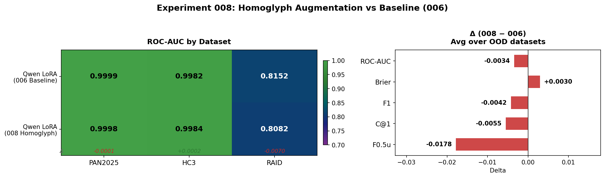

# Results: 008-homoglyph

**Experiment**: Homoglyph data augmentation for robust AI text detection
**Model**: Qwen2.5-1.5B LoRA (trained with 10% homoglyph-augmented AI samples)
**Adapter**: `hersheys-baklava/pan2026-qwen-homoglyph`
**Date**: 2026-02-17

## Summary

Homoglyph augmentation (5% per-char unicode swap + 5% ZWJ insertion on 10% of AI training samples) produces **mixed results** — marginal HC3 gains are offset by RAID regression. The overall OOD average ROC-AUC drops from 0.9067 → 0.9033.

**Verdict**: Rejected. Homoglyph augmentation at mdok's default parameters does not improve OOD generalization for our Qwen2.5-1.5B LoRA setup.

## Heatmap

## ROC-AUC Comparison

| Model | PAN2025 | HC3 | RAID | Avg OOD |
|-------|--------:|----:|-----:|--------:|
| **Qwen LoRA (006)** | **0.9999** | 0.9982 | **0.8152** | **0.9067** |
| Qwen LoRA + Homoglyph (008) | 0.9998 | **0.9984** | 0.8082 | 0.9033 |
| Δ (008 − 006) | −0.0001 | +0.0002 | −0.0070 | −0.0034 |

## Full Metrics Comparison

| Dataset | Metric | 006 Baseline | 008 Homoglyph | Δ |
|---------|--------|-------------:|--------------:|--:|
| PAN2025 | ROC-AUC | **0.9999** | 0.9998 | −0.0001 |
| PAN2025 | Brier | **0.0019** | 0.0021 | +0.0002 |
| PAN2025 | F1 | **0.9981** | 0.9978 | −0.0003 |
| PAN2025 | C@1 | **0.9975** | 0.9972 | −0.0003 |
| PAN2025 | F0.5u | 0.9984 | **0.9989** | +0.0005 |
| HC3 | ROC-AUC | 0.9982 | **0.9984** | +0.0002 |
| HC3 | Brier | 0.0112 | **0.0060** | −0.0052 |
| HC3 | F1 | 0.9868 | **0.9934** | +0.0066 |
| HC3 | C@1 | 0.9869 | **0.9935** | +0.0066 |
| HC3 | F0.5u | 0.9947 | **0.9959** | +0.0012 |
| RAID | ROC-AUC | **0.8152** | 0.8082 | −0.0070 |
| RAID | Brier | **0.1491** | 0.1602 | +0.0111 |
| RAID | F1 | **0.8182** | 0.8032 | −0.0150 |
| RAID | C@1 | **0.8460** | 0.8284 | −0.0176 |
| RAID | F0.5u | **0.9176** | 0.8808 | −0.0368 |

## Key Findings

1. **HC3 improved across all metrics** — Brier dropped 46% (0.0112 → 0.0060), F1 jumped +0.0066. HC3 contains ChatGPT-generated text, and the augmentation may help with this specific distribution.

2. **RAID regressed across all metrics** — ROC-AUC dropped by 0.007, F0.5u by 0.037. RAID contains many different generators and attack types; homoglyph augmentation alone doesn't help with this diversity.

3. **PAN2025 essentially unchanged** — all deltas are within ±0.0005, effectively noise. In-distribution performance is preserved.

4. **Net effect is negative** — the RAID regression outweighs the HC3 gains, making the overall OOD average worse.

## Why It Didn't Work

- **mdok uses a 14B model** (Qwen3-14B-Base) with 4-bit quantization and `r=64` LoRA. Our 1.5B model with `r=16` may not have enough capacity to benefit from the augmentation.
- **mdok trains on combined train+val** and uses a separate OOD dataset (MIX2k) for checkpoint selection. We train only on train and evaluate on val.
- **mdok also lowercases text and replaces PII** (emails, phones, usernames). These preprocessing steps may interact synergistically with homoglyph augmentation.

## Recommendations

1. **Do not adopt** homoglyph augmentation at these parameters for our 1.5B model.
2. **Future work**: try with a larger model (e.g., Qwen3-4B or 14B), or combine homoglyph augmentation with mdok's full preprocessing pipeline.
3. **Alternative**: try higher augmentation rates (e.g., 30-50% of AI samples) to force stronger regularization.

## Artifacts

| File | Description |
|------|-------------|
| `artifacts/homoglyph_comparison.csv` | Full metrics comparison table |
| `artifacts/homoglyph_heatmap.png` | Visual comparison heatmap |