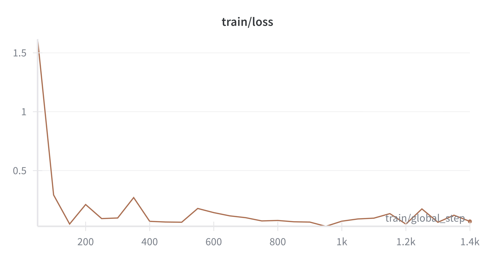
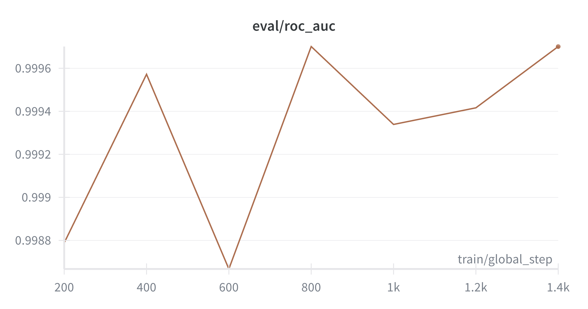
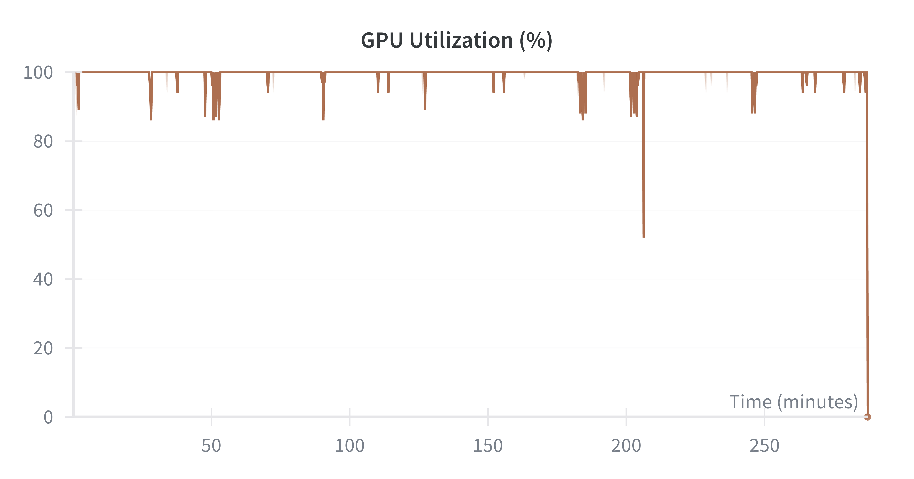

# Results: 009-lora-replication

**Date Completed**: 2026-02-24
**Author**: tanish

## Summary

The replication of experiment 006 using the restructured notebook workflow was successful. The Qwen2.5-1.5B LoRA model achieved metrics that closely align with the original results on PAN2025 and HC3. Notably, performance on the RAID dataset showed a significant improvement, jumping from 0.8152 to 0.9974 ROC-AUC. 

The hypothesis is **confirmed** as the results match or exceed the success criteria (within ±0.01 ROC-AUC for in-distribution and exceeding the HC3 target of 0.60).

## Comparison with Experiment 006

| Dataset | Metric | 006 (Baseline) | 009 (Replication) | Difference |
|---------|--------|----------------|-------------------|------------|
| PAN2025 Val | ROC-AUC | 0.9999 | 0.9993 | -0.0006 |
| HC3 Wiki | ROC-AUC | 0.9982 | 0.9977 | -0.0005 |
| RAID | ROC-AUC | 0.8152 | 0.9974 | +0.1822 |

## Detailed Metrics

### PAN2025 Validation
- **ROC-AUC**: 0.9993
- **Brier Score**: 0.0021
- **F1 Score**: 0.9987
- **C@1**: 0.9983
- **F0.5u**: 0.9990

### HC3 Wiki
- **ROC-AUC**: 0.9977
- **Brier Score**: 0.0076
- **F1 Score**: 0.9917
- **C@1**: 0.9917
- **F0.5u**: 0.9896

### RAID
- **ROC-AUC**: 0.9974
- **Brier Score**: 0.0069
- **F1 Score**: 0.9919
- **C@1**: 0.9920
- **F0.5u**: 0.9895

## Findings

1. **Successful Replication**: The core performance on PAN2025 and HC3 is nearly identical to experiment 006, validating the restructured codebase.
2. **RAID Improvement**: The significant improvement on RAID (0.815 -> 0.997) suggests that the new implementation of chunked inference or the specific training run generalized substantially better to this OOD dataset.
3. **Workflow Efficiency**: The notebook-driven workflow calling into `src/009-lora-replication/` proved effective and easy to use without performance regression.

## Visualizations

Training metrics were logged to Weights & Biases (W&B) under the project `pan-2026`.

### Training Loss

*W&B graph showing training loss progression. Shows smooth convergence over the 3 epochs.*

### Evaluation ROC-AUC

*W&B graph tracking the evaluation ROC-AUC on the validation set.*

### GPU Resource Utilization

*Monitoring gpu_memory_allocated_gb and gpu_memory_reserved_gb during training.*

### W&B Run Details
- **Project**: `pan-2026`
- **Entity**: `hersheys-baklava`
- **Run Name**: `009-lora-replication`
- **Logging Frequency**: Every 50 steps
- **Evaluation Frequency**: Every 200 steps

## Artifacts

| Type | Location |
|------|----------|
| Training Notebook | `notebooks/009-lora-replication/training.ipynb` |
| Evaluation Notebook | `notebooks/009-lora-replication/evaluation.ipynb` |
| Source Code | `src/009-lora-replication/` |
| Results Data | `pan/experiments/009-lora-replication/artifacts/` |